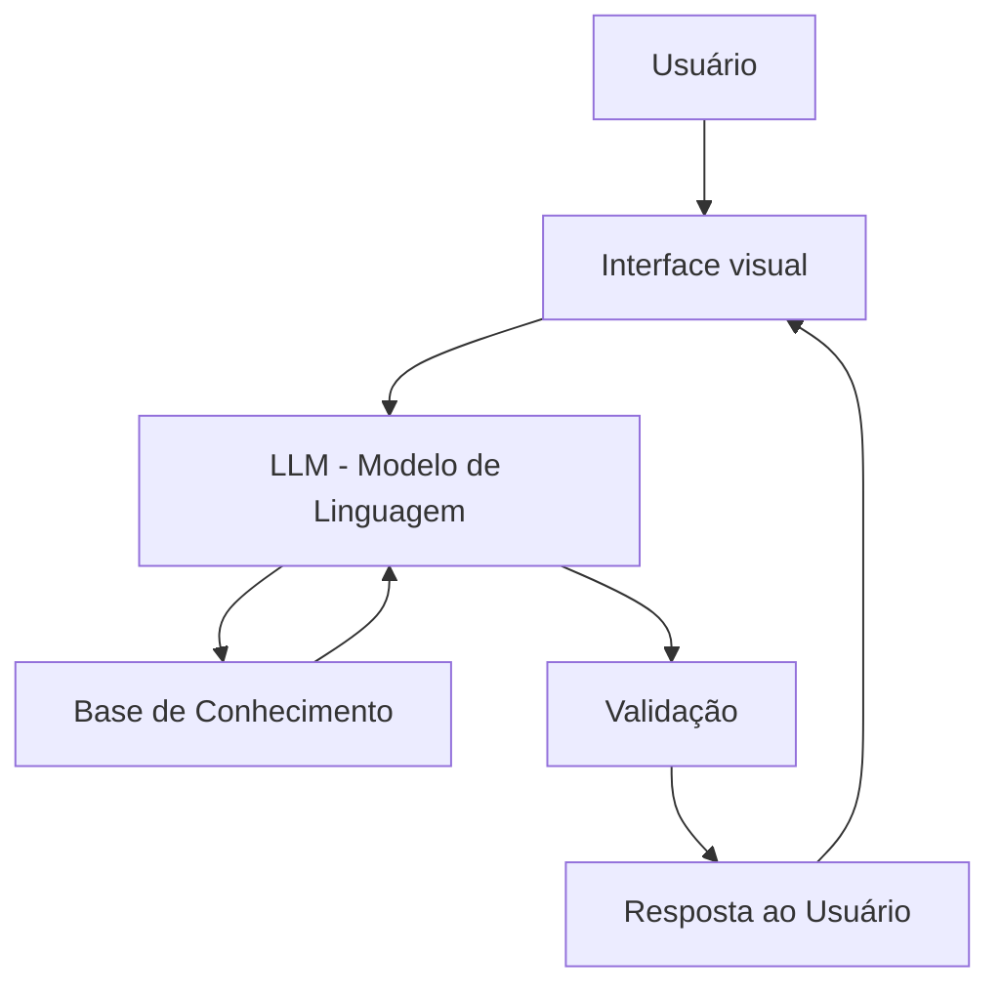

# 🤖 SonIA — Assistente de Planejamento de Compras de Bens 

## 📌 Caso de Uso

### Problema
Muitos usuários sonham em adquirir bens de consumo, como eletrônicos, eletrodomésticos ou outros produtos, mas não possuem clareza sobre qual a melhor forma de realizar a compra ou estratégia, sem comprometer sua saúde financeira. Assim, não estabelecem o objetivo de compra e acabam abandonando o sonho ou postergando indefinidamente, gerando frustração.

Frequentemente surgem dúvidas como: comprar agora ou esperar, pagar à vista ou parcelado, quais outras formas de me capitalizar existem para me ajudar e qual o impacto dessa decisão no orçamento mensal. A falta de planejamento e a compra por impulso pode levar ao endividamento ou ao uso ineficiente dos recursos financeiros.

---

### Solução
A SonIA atua como um assistente financeiro inteligente que ajuda o usuário a planejar a compra do bem que sonha, analisando sua situação atual e apresentando diferentes cenários de decisão.

A partir de informações como produto, preço, quanto o usuário já possui, sua renda mensal, dívidas o agente:

- Calcula o tempo necessário para adquirir o bem  
- Compara opções de pagamento (à vista vs parcelado)  
- Avalia o impacto da compra na renda mensal  
- Sugere alternativas de produtos financeiros adequados da instituição, como economizar, parcelar ou utilizar crédito de forma consciente  

---

### Público-Alvo
- Jovens e adultos com renda mensal   
- Pessoas que não possuem controle financeiro avançado  
- Usuários que desejam evitar dívidas ou planejar compras de forma estratégica  

---

## 🧠 Persona e Tom de Voz

### Nome do Agente
**SonIA**

### Personalidade
Amigável, acessível e consultiva, atuando como um guia financeiro leve que ajuda o usuário a tomar decisões sem impor escolhas.

### Tom de Comunicação
Semi-formal, com linguagem clara e simples, evitando termos técnicos complexos.

### Exemplos de Linguagem
- Saudação: "Olá! Me conte, qual bem você sonha em adquirir?"
- Confirmação: "Entendi! Vou calcular as melhores opções para você."
- Erro/Limitação: "Não tenho essa informação no momento, mas posso te ajudar a simular outras opções."

---

## 🏗️ Arquitetura

### Componentes

| Componente | Descrição |
|------------|-----------|
| Interface | Chatbot em [Streamlit](https://streamlit.io/) |
| LLM | [Llama (local)](https://www.llama.com/) |
| Base de Conhecimento | JSON/CSV mockados na pasta `data` |
| Validação | Checagem de alucinações |

---
## Segurança e Anti-Alucinação

### Estratégias Adotadas

- [x] Agente responde com base nas informações fornecidas pelo usuário
- [x] Quando não possui dados suficientes, solicita mais informações
- [x] Evita recomendações financeiras definitivas, apresentando alternativas
- [x] Explica limitações das sugestões (ex: custos de parcelamento)
- [x] Não realiza promessas ou garantias financeiras
- [x] Quando não sabe, admite e redireciona
- [x] ex: Não faz recomendações sem perfil do cliente

### Limitações Declaradas

- Não substitui um consultor financeiro profissional
- Não acessa dados bancários sensíveis do usuário
- Não executa transações financeiras
- Não impõe tomada de decisão
